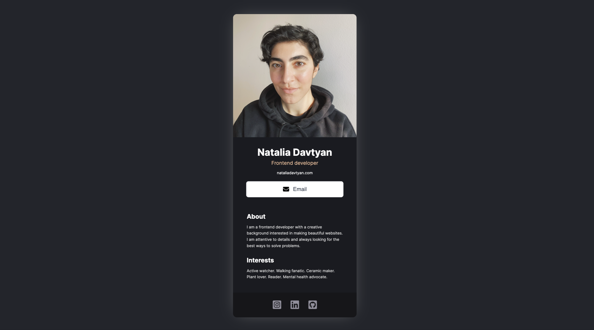

# Digital business card

Personal digital business card

## Features
Includes my contact details, professinal links and short info about me.

## Demo

Test it on Netlify: https://dancing-paprenjak-379200.netlify.app/

## Technologies
The project is built using:
* HTML
* CSS
* JavaScript
* React

## Technical details
* Used separate components for each section.
* Rendered by using React.
* Followed the design file on Figma.

## Project status
The project is complete.

## Acknowledgements
Digital business card is a solo project that was part of [the Frontend Developer Career Path at Scrimba](https://scrimba.com/learn/frontend).

## Contact
Created by [Natalia Davtyan](https://github.com/nataliadavtyan)